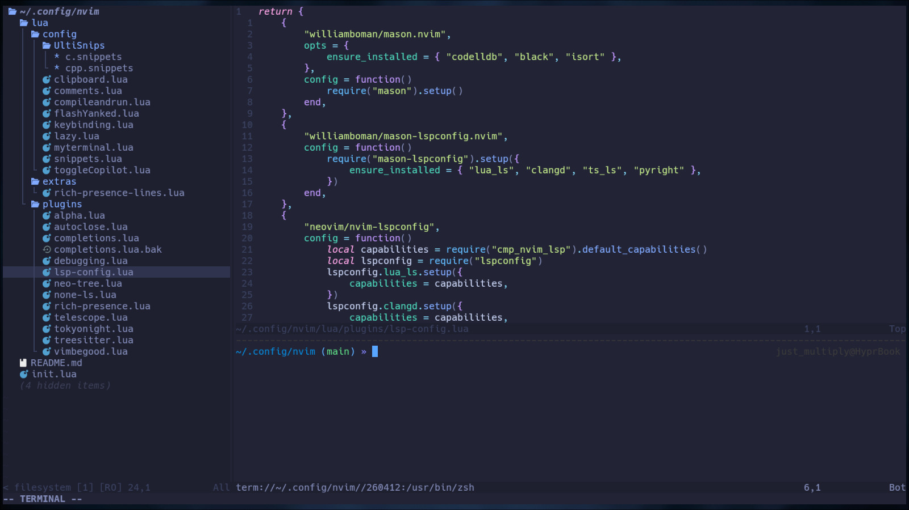
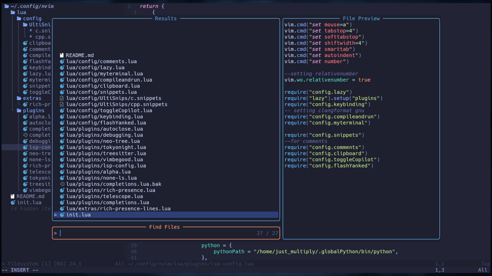
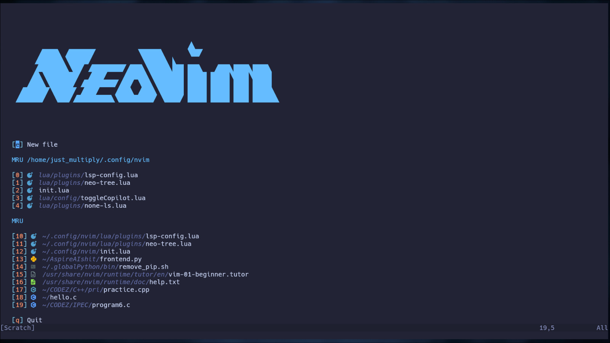

<h1 align="center">🧠 justmultiply/nvim</h1>
<p align="center">
  <b>Hyper-minimal. Blazing Fast. Battle-ready Neovim config.</b><br>
  ⚙️ Built for speed • 🧬 Modular by design • ⌨️ Terminal-native focus
</p>

<p align="center">
  
  
  
</p>

---

## 🚀 Quick Installation

> ⚠️ Requires Neovim 0.9+ and a Unix-based system (Tested on Arch Linux)

```bash
git clone https://github.com/justmultiply/neovimconfig ~/.config/nvim
nvim
```

Lazy.nvim will auto-install plugins on first launch.

---

## 🧭 Overview

A lean, modular, high-performance Neovim configuration tailored for Linux + Tiling WMs. Built for users who demand precision and aesthetics.

> *This is not a starter config. This is a tactical editor setup.*

---

## 🖼️ Screenshots

| UI Preview | Telescope | Zeroscreen (Alpha.nvim) |
|------------|-----------|--------------------------|
|  |  |  |

> 🖼️ Home screen powered by [alpha-nvim](https://github.com/goolord/alpha-nvim)

---

## ⚙️ Core Features

- 🚀 Fast lazy-loaded startup via Lazy.nvim
- 🎯 Minimal UI with floating borders & clean highlights
- 🔧 LSP, Mason, Autocompletion (`nvim-cmp`)
- 🔍 Telescope for fuzzy file/symbol navigation
- 🌌 TokyoNight theme for a modern look
- 📜 Treesitter for advanced syntax highlighting
- 🗂️ Neotree for file browsing
- 📊 Statusline with Lualine
- 🧠 LSP Diagnostics, DAP-ready
- 🏠 Beautiful start screen with ASCII art & sessions

---

## 🧩 Tech Stack

| Tool / Plugin     | Purpose                       |
|-------------------|-------------------------------|
| Neovim (0.9+)     | Core Editor                   |
| Lua               | Configuration Language        |
| Lazy.nvim         | Plugin Manager                |
| Mason.nvim        | LSP/DAP Installer             |
| Telescope         | Fuzzy Finder                  |
| Treesitter        | Syntax Highlighting           |
| nvim-cmp          | Autocompletion                |
| Lualine           | Status Line                   |
| TokyoNight        | Theme                         |
| alpha-nvim        | Custom Dashboard / Zeroscreen |

---

## 💻 Languages Supported (Out-of-the-box)

- 🐍 Python
- 📜 JavaScript / TypeScript
- 🌐 HTML / CSS / Tailwind
- 📦 JSON / YAML / TOML
- 🔧 Bash / Shell
- ☕ Java
- 🧠 Lua

> Managed via Mason. Add more with a few lines.

---

## 🎯 Usage & Benefits

- Distraction-free workflow for focused development
- Power-user navigation: instant file/symbol jumping
- Minimal boilerplate—only what you need, nothing else
- Built to feel *invisible*—everything just works

---

## 📉 Limitations

- ❌ Not beginner-friendly (requires Neovim knowledge)
- ⛔ Terminal-only (no GUI support)
- 🌱 Manual plugin tweaking for unsupported languages

---

## 🪪 License

MIT © [justmultiply](https://github.com/justmultiply)

---

<p align="center"><i>“There is elegance in speed. There is beauty in silence.”</i></p>
