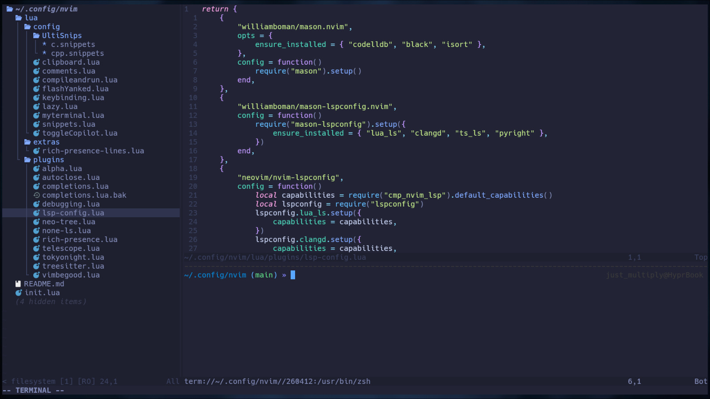
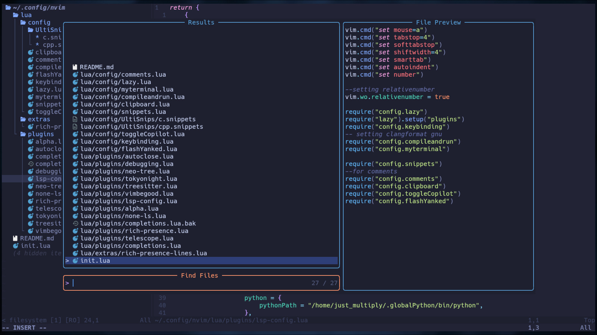
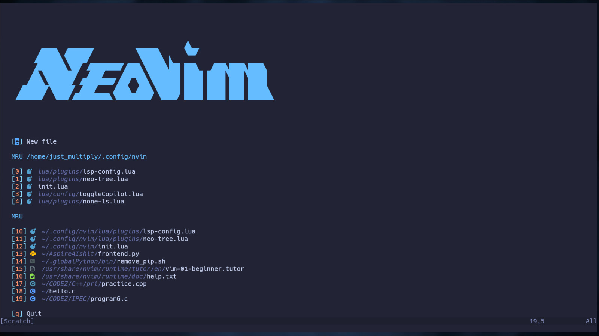

# 🧠 realSUDO/rootVim

<p align="center">
  <b>Hyper-minimal. Blazing Fast. Battle-ready Neovim Config.</b><br>
  ⚙️ Built for speed • 🧩 Modular by design • ⌨️ Terminal-native focus
</p>

<p align="center">
  
  
  
</p>

<p align="center">
  
</p>

<p align="center">
  
  
</p>

---

## 🔑 Quick Binds (Essentials)

| Action                  | Keybind                |
|--------------------------|------------------------|
| Hover Docs               | `K`                   |
| Go to Definition         | `gd`                  |
| Code Action              | `<leader>ca`          |
| Format Buffer            | `<leader>gf`          |
| File Explorer (Neo-tree) | `<leader>nn` / `<leader>nt` |
| Breakpoint (DAP)         | `<leader>dt`          |
| Continue (DAP)           | `<leader>dc`          |
| Find Files (Telescope)   | `<C-p>`               |
| Terminal Horizontal      | `<leader>tt` (n)      |
| Terminal Vertical        | `<leader>ty`          |
| Window Navigation        | `<C-h/j/k/l>`         |
| Compile & Run            | `<leader><leader><leader>r` |
| Toggle Copilot           | `:Copilot`            |
| Theme Selector           | `:ThemeSelector`      |

---

## 🚀 Full Installation

### Auto Installation (Recommended)

Run this one-liner to install with all dependencies:

```bash
curl -sL https://raw.githubusercontent.com/realSUDO/rootVim/main/install.sh | bash
```

Or clone and run manually:

```bash
git clone https://github.com/realSUDO/rootVim && cd rootVim && chmod +x install.sh && ./install.sh
```

The installer will:
- Install dependencies
- Configure Python + Clipboard
- Backup existing configs
- Auto-install all plugins

### Manual Installation

**Dependencies:**
- Neovim 0.9+
- Python 3.10+ + pip
- Node.js 16+ + npm
- Clang

```bash
# Arch
sudo pacman -S --needed neovim python-pip nodejs npm clang

# Ubuntu/Debian
sudo apt install neovim python3-pip nodejs npm clang
```

Python Env:
```bash
python3 -m venv ~/.globalPython
~/.globalPython/bin/pip install pynvim black isort
```

Clipboard:
- X11 → `xclip`
- Wayland → `wl-clipboard`

Config:
```bash
git clone https://github.com/realSUDO/rootVim ~/.config/nvim
nvim +Lazy sync
```

---

## 🎮 Full Keymap Reference

<details>
<summary>Click to Expand</summary>

### LSP
- `K` → Hover docs  
- `gd` → Go to definition  
- `<leader>ca` → Code actions (normal/visual)

### Tree-sitter
- `<C-space>` → Init selection / Node incremental  
- `<bs>` → Node decremental

### Null-ls
- `<leader>gf` → Format buffer (5s timeout)

### Neo-tree
- `<leader>nn` → Reveal filesystem (left)  
- `<leader>nt` → Toggle tree

### Debugging (DAP)
- `<leader>dt` → Toggle breakpoint  
- `<leader>dc` → Continue execution

### Completions (nvim-cmp)
- `<C-b>` / `<C-f>` → Scroll docs up/down  
- `<C-Space>` → Trigger completion  
- `<C-e>` → Abort completion  
- `<CR>` → Confirm selection

### Navigation
- `<C-h/j/k/l>` → Window navigation (left/down/up/right)

### Terminals
- `<leader>tt` (t) → Close terminal pane  
- `<leader>tt` (n) → Open horizontal terminal  
- `<leader>ty` → Open vertical terminal

### Utilities
- `<C-p>` → Find files (Telescope)  
- `<leader><leader><leader>r` → Save + Compile & Run  
- `<leader><leader>co` → Toggle Copilot  
- `<leader>tw` → Toggle line wrap

### Snippets
- `<Tab>` → Expand snippet / Jump forward  
- `<S-Tab>` → Jump backward

</details>

---

## ⚙️ Features
- 🚀 Ultra-fast lazy-loading
- 🎯 Minimal UI (floating borders, clean highlights)
- 🔧 LSP, Mason, Autocompletion
- 🔍 Telescope for navigation
- 🌌 TokyoNight theme
- 📜 Treesitter highlighting
- 🗂️ Neotree file browsing
- 📊 Lualine statusline
- 🧠 Diagnostics + DAP ready
- 🏠 ASCII start screen + sessions
- 🤖 GitHub Copilot integration
- 🎨 Live theme selector (by github.com/realSUDO)

---

## 🧩 Tech Stack

| Tool / Plugin   | Purpose                        |
|-----------------|--------------------------------|
| Neovim (0.9+)   | Core Editor                    |
| Lua             | Configuration Language         |
| Lazy.nvim       | Plugin Manager                 |
| Mason.nvim      | LSP/DAP Installer              |
| Telescope       | Fuzzy Finder                   |
| Treesitter      | Syntax Highlighting            |
| nvim-cmp        | Autocompletion                 |
| Lualine         | Status Line                    |
| TokyoNight      | Theme                          |
| alpha-nvim      | Dashboard / Zeroscreen         |

---

## 📉 Limitations
- ❌ Not beginner-friendly
- ⛔ Terminal-only (no GUI)
- 🌱 Some language configs require manual tweaks

---

## 🪪 License

MIT © realSUDO

<p align="center"><i>"There is elegance in speed. There is beauty in silence."</i></p>
